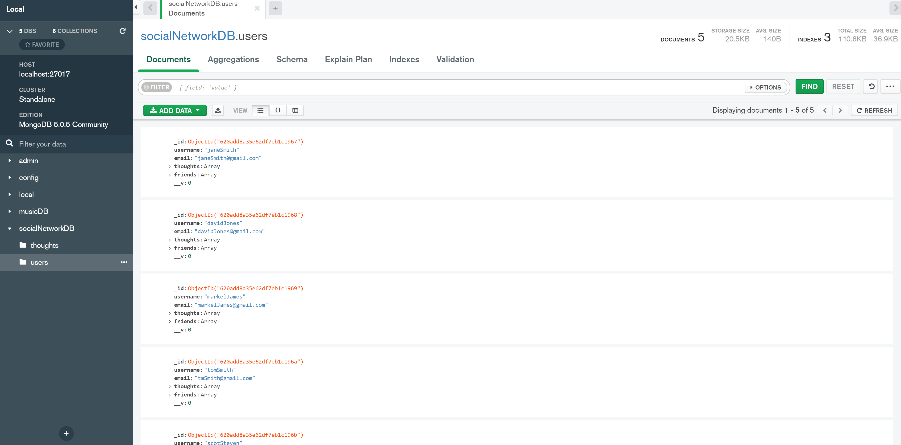
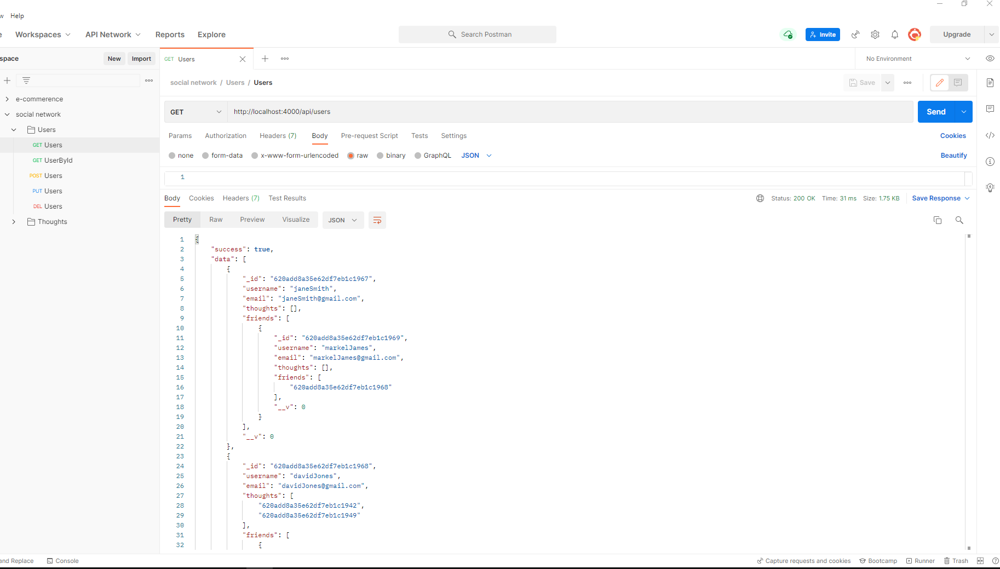

# Social Network API 

## Description:

For this project, my aim was to build an API for a social network web application where users can share their thoughts, react to friends’ thoughts, and create a friend list.

## Table of contents:
- [Links](#links)
- [Usage](#usage)
- [Technologies Used](#technologies-used)
- [Screenshots](#screenshots)
- [Contribute](#contribute)

## Links:

### Demo:

- Part 1: https://drive.google.com/file/d/1uaacBjuMR4UFn4rd9WMcldAdsmgfDe-1/view?usp=sharing

### Github:

https://github.com/AsmaaMusse/social-network-api

## Technologies Used:

- Javascript
- Node.js
- Express.JS
- MongoDB
- Mongoose ODM

## Usage:

### Installation

```
git@github.com:AsmaaMusse/social-network-api.git
cd social-network-api
npm install / npm i
```

### Seed

```
npm run seed
```

### Start

```
npm run start
```

## Screenshots:





## Contribute

To contribute or ask questions, please <a href="https://mail.google.com/mail/u/0/?tf=cm&to=asmaamusse03@gmail.com&cc&bcc&su&body&fs=1">Email</a> here
